# 팅커벨 (TinkerBell) - 안전한 부동산 계약 도우미

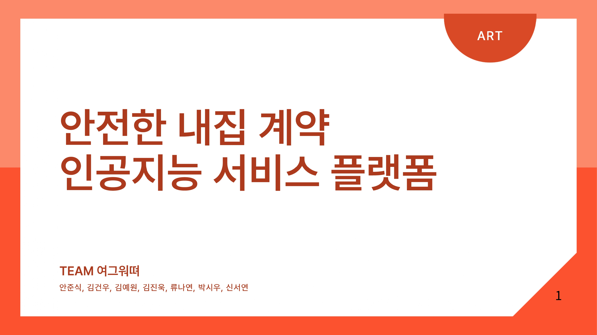

## 🏆 프로젝트 개발 배경

### AWS 해커톤 도전
본 프로젝트는 AWS 주최 해커톤 "지역 사회 문제 해결" 부문에서 시작되었습니다. 청년층의 전세사기 피해가 급증하는 사회적 문제를 해결하고자 기획되었으며, 다음과 같은 과정을 거쳐 발전했습니다:

### 아이디어 발전 과정
1. 초기 기획
   - 계약서 비교 분석 앱 구상
   - 임대차 계약 특약 사항 분석
   - 기존 계약서와의 비교 기능

2. 차별화 전략 수립
   - 100점 기준 계약서 평가 시스템 도입
   - 단계별 체크리스트 시스템 구축
   - 기존 서비스와의 차별성 확보

### 핵심 구현 요소
- 계약 단계별 체크리스트
  - 계약 전: 중개인 확인, 매물 확인, 임대인 확인
  - 계약 중: 계약서 확인, 특약 확인, 요금 확인
  - 계약 후: 신청사항 확인, 보관사항 확인
  - 입주 관련: 신청사항, 연락사항, 계약사항 확인

## 💡 프로젝트 개요

부동산 계약 과정에서 발생할 수 있는 사기를 예방하고, 안전한 거래를 지원하는 AI 기반 서비스입니다. 전세사기 피해가 증가하는 현 상황에서, 계약 전/중/후의 전 과정을 체계적으로 관리할 수 있는 솔루션을 제공합니다.

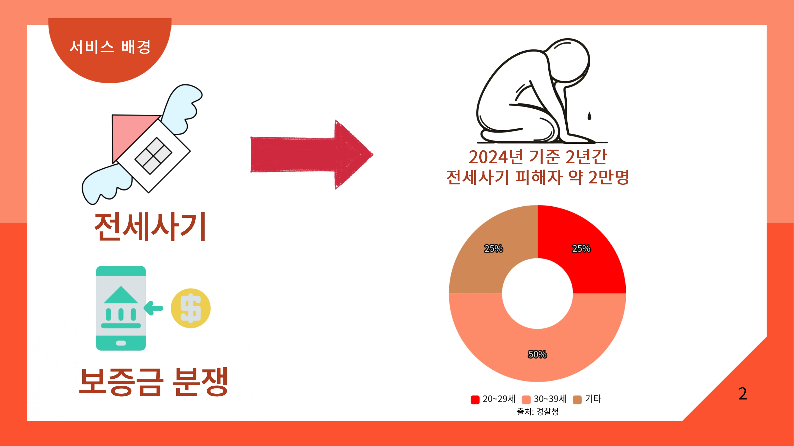
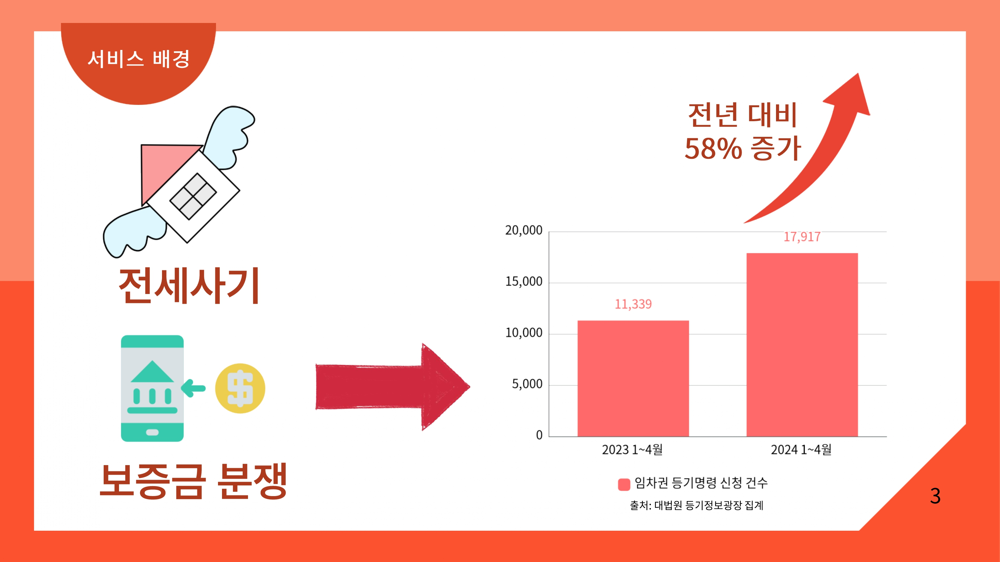
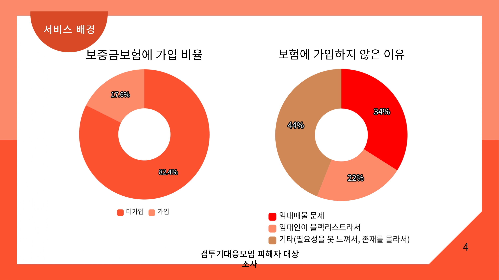

## 🔍 주요 기능 상세

### 1. 체크리스트 시스템
계약 과정별 필수 확인사항을 제공합니다:

#### 계약 전 체크리스트
- 공인중개사 자격 검증 (국가공간정보포털 연동)
- 현장 점검 항목 (수압, 수질, 하자 여부)
- 등기부등본 확인 사항

#### 계약 중 체크리스트
- 근저당권 설정 확인
- 특약사항 필수 포함 항목
- 월세/관리비 세부 내역 확인

#### 계약 후 체크리스트
- 확정일자 및 전입신고 가이드
- 공과금 관리 방법
- 입주 전/후 상태 체크

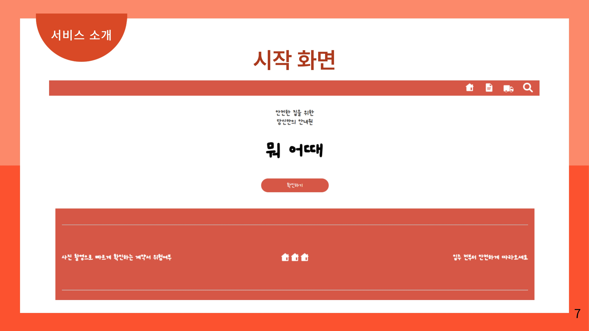
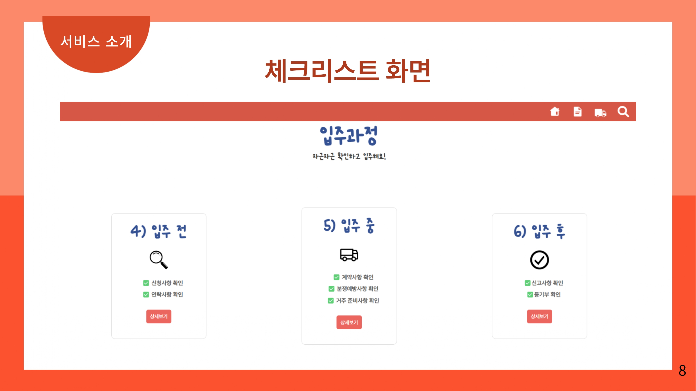

### 2. AI 기반 계약서 분석
전문 변호사와 부동산 전문가의 자문을 바탕으로 개발된 AI 분석 시스템입니다:

- OCR 기술을 활용한 계약서 텍스트 추출
- 특약조항의 법적 유효성 검증
- 임차인 권리보호 조항 분석

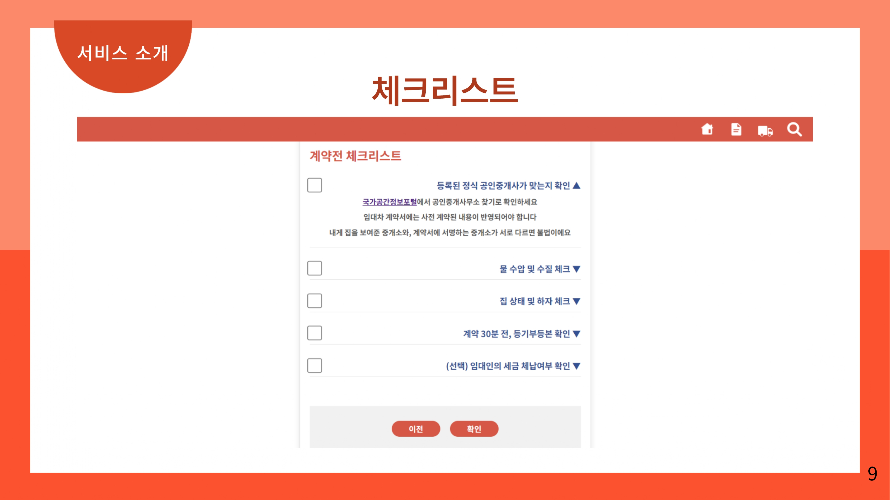
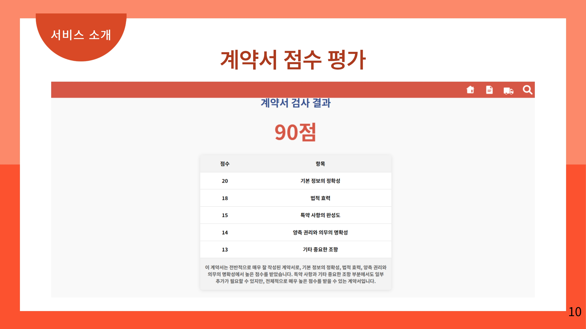

### 개발 주안점
1. 안정성 
   - AI 분석의 일관성 확보
   - 명확한 평가 기준 설정
   - 동일 자료에 대한 동일 평가 보장

2. 사용자 편의성
   - 로그인 없는 간편한 접근
   - 직관적인 UI/UX
   - 단계별 가이드 제공

3. 확장성
   - AWS 서버리스 아키텍처 활용
   - 스프링부트 AI 스타터 적용
   - 모듈화된 설계

### 개발 워크플로우
```
1. 사전 체크리스트 작성
2. 계약서 본문 데이터 수집
3. AI 분석 시스템 처리
4. 분석 결과 시각화
5. 사용자 피드백 반영
```

## 🌟 서비스 차별점

기존 부동산 서비스와의 차별점을 구체적으로 분석했습니다:

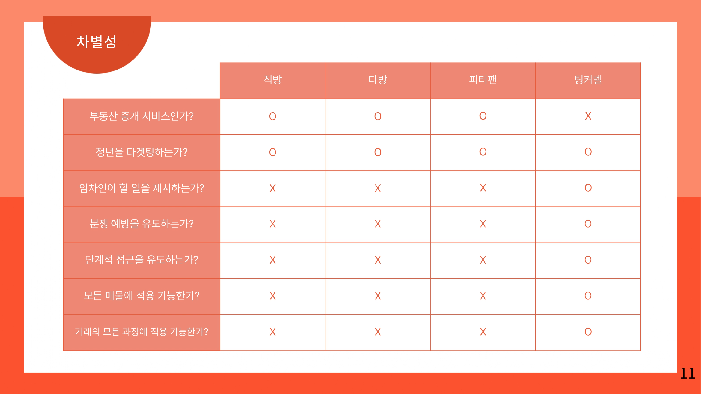

### 핵심 차별화 요소
- 임차인 관점의 종합 솔루션
- AI 기반 계약서 위험도 평가
- 단계별 증거자료 관리 시스템
- 공공데이터 연계 검증

## 📱 비즈니스 모델

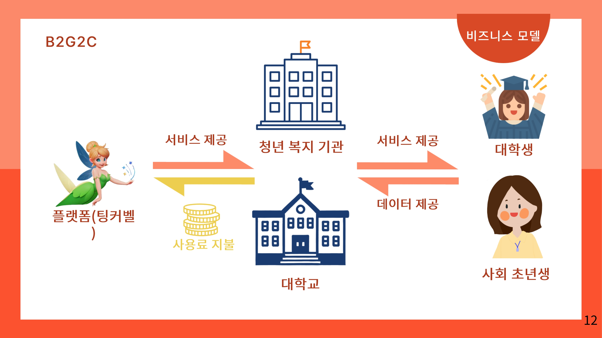

### 수익 구조
- 공공기관 협력 모델
- 대학교 학생 지원 시스템 연계
- 임대차 분쟁 예방 서비스

## 🔧 기술 스택

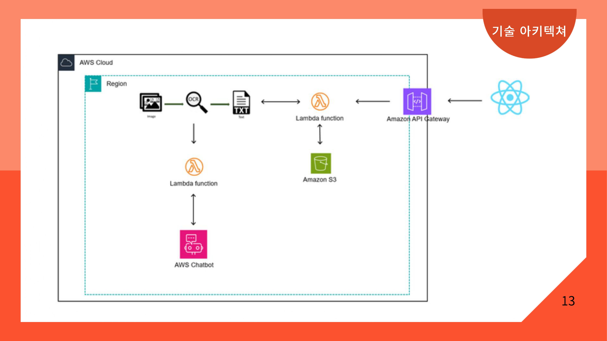

### 상세 기술 스택
- Frontend: React.js, TailwindCSS
- Backend: AWS Lambda, Spring Boot
- AI/ML: AWS Comprehend, Amazon Textract
- Storage: Amazon S3, DynamoDB
- API: Amazon API Gateway

## 👥 팀 구성

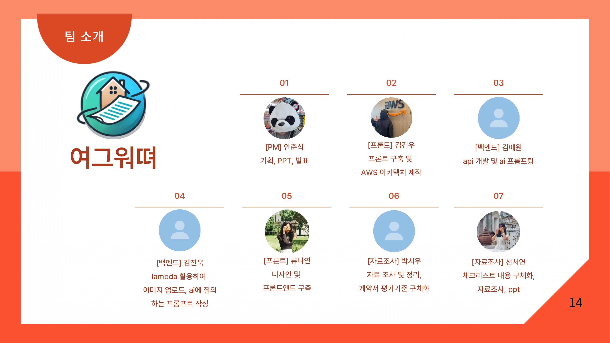

각 팀원의 세부 담당 업무:
- 안준식 [PM]: 서비스 기획/총괄
- 김건우 [FE]: AWS 아키텍처 설계
- 김예원 [BE]: API/AI 시스템 개발
- 김진욱 [BE]: 이미지 처리/서버리스 구현
- 류나연 [FE]: UI/UX 디자인
- 박시우 [Research]: 평가기준 수립
- 신서연 [Research]: 체크리스트 설계

---
© 2024 Team YeoGeuWater. All Rights Reserved.
